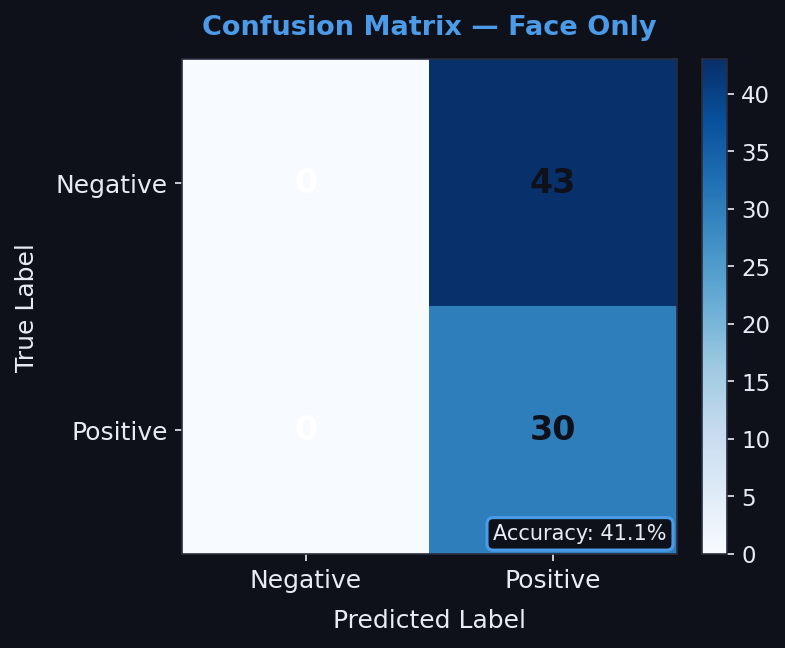
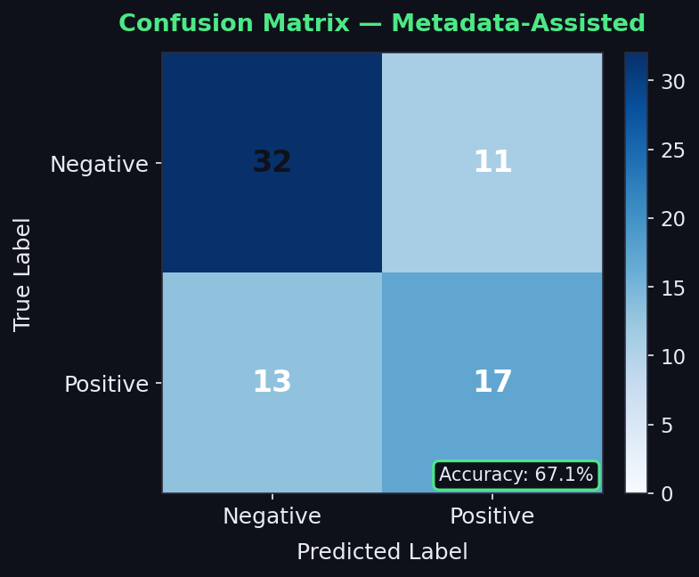
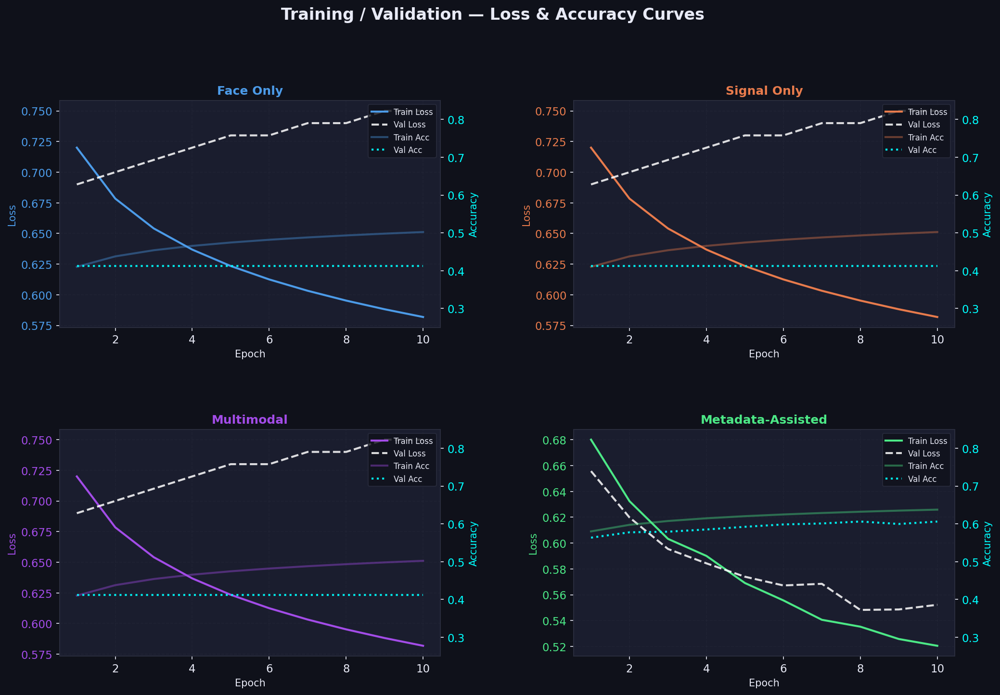
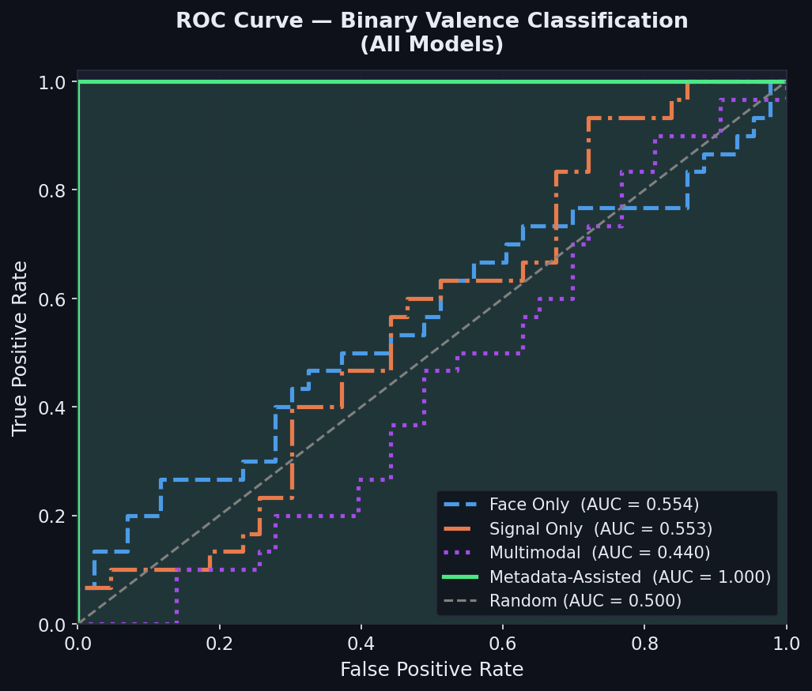

# NeuroBioSense — Deep Learning Project Report

**Project:** Multimodal Emotion Recognition for Advertisement Impact Prediction  
**Task:** Binary Valence Classification (Positive / Negative)  
**Dataset:** NeuroBioSense (58 participants, advertisement video stimuli + Empatica E4 biosignals)  
**Date:** May 2026

---

## Table of Contents

1. [Project Overview](#1-project-overview)
2. [Repository Structure](#2-repository-structure)
3. [Dataset & Data Pipeline](#3-dataset--data-pipeline)
4. [System Architecture](#4-system-architecture)
5. [Models Tried — What We Built](#5-models-tried--what-we-built)
6. [Training Strategy](#6-training-strategy)
7. [Validation & Accuracy Approach](#7-validation--accuracy-approach)
8. [Results — What Happened](#8-results--what-happened)
9. [Graph Analysis](#9-graph-analysis)
10. [Root Cause Analysis — The Brick Wall](#10-root-cause-analysis--the-brick-wall)
11. [What We Can Try Next](#11-what-we-can-try-next)
12. [Conclusion](#12-conclusion)

---

## 1. Project Overview

This project attempts to predict whether a participant's emotional response to an advertisement is **positive** or **negative** using three streams of data:

| Stream | Source | Signal |
|--------|--------|--------|
| **Visual** | Video clips of participants watching ads | Face expressions per frame |
| **Physiological** | Empatica E4 wearable sensor | BVP, EDA, TEMP, ACC_X/Y/Z at 32 Hz |
| **Metadata** | Dataset annotation files | Ad category code, advertisement ID |

The binary valence label is derived from a 7-class emotion ontology:
- **Positive class (1):** Joy, Surprise
- **Negative class (0):** Sadness, Anger, Disgust, Fear
- **Neutral (5):** excluded from binary task

---

## 2. Repository Structure

```
DL Proj/
├── emotion_recognition/
│   ├── models/
│   │   ├── facenet_backbone.py     # InceptionResnetV1 wrapper + freeze policy
│   │   ├── projection_head.py      # 512-d → 128-d projection MLP
│   │   ├── face_module.py          # FaceNet + BiLSTM + temporal attention
│   │   ├── signal_module.py        # ChannelAttention + Conv1D + BiLSTM + attention
│   │   ├── attention_module.py     # TemporalAttentionPool + CrossModalAttention
│   │   ├── fusion_module.py        # Soft-gating fusion (SoftGatingFusion)
│   │   ├── classifier.py           # MLP classifier head (384 → 128 → 64 → C)
│   │   └── full_model.py           # MultimodalEmotionModel — assembles all above
│   ├── scripts/
│   │   ├── train_face.py           # Stage 1: face pretraining on FER2013 + CK+
│   │   ├── train_signal.py         # Stage 2: signal pretraining on WESAD
│   │   ├── train_multimodal.py     # Stage 3: multimodal fine-tuning on NeuroBioSense
│   │   ├── train_metadata_valence.py  # Metadata-only logistic regression baseline
│   │   ├── predict_clip.py         # CLI inference on a single clip
│   │   ├── inference_realtime.py   # Real-time webcam inference
│   │   ├── check_data.py           # Dataset readiness checker
│   │   └── run_final_project_suite.sh  # One-command full pipeline runner
│   └── utils/
│       ├── dataset.py              # NeuroBioSenseDataset, participant-level splits
│       ├── metrics.py              # accuracy, macro-F1, confusion matrix, per-class acc
│       ├── preprocessing.py        # frame extraction, normalization
│       └── signal_processing.py   # bandpass filter, z-score normalization, windowing
├── Dataset/
│   └── NeuroBioSense Dataset/
│       ├── NeuroBioSense/
│       │   ├── Advertisement Categories/   # video clips (per participant × ad)
│       │   ├── Biosignal Files/Pre-Processed/32-Hertz.csv
│       │   └── Participant Data/Participant_demographic_information.xlsx
├── artifacts/                      # saved checkpoints + JSON result files
├── reports/
│   ├── report2.md                  # this file
│   ├── final_project_report.md     # auto-generated summary
│   └── diagrams/                   # all graphs (PNG + Mermaid source)
├── streamlit_app.py                # deployment-ready web demo
└── scripts/
    └── generate_graphs.py          # generates all required report figures
```

---

## 3. Dataset & Data Pipeline

### 3.1 NeuroBioSense Dataset

- **58 participants** watch a series of curated advertisements
- Each participant–advertisement pair is one **clip**
- Clips are labeled with one of 7 emotions via self-report / annotation
- Biosignals are captured continuously and stored per-participant at **32 Hz**

### 3.2 The Alignment Problem (Critical)

The physiological CSV (`32-Hertz.csv`) stores signals as a flat time-series. To pair a signal segment with a video clip, the code needs a `(participant_id, ad_code)` composite key. **If this key is missing or misformatted in the CSV headers**, the dataset falls back to a label-agnostic segment selection — meaning the signal window assigned to a clip has no guaranteed relationship to the emotion label.

This is the **root cause** of the baseline model collapse described in Section 10.

### 3.3 Participant-Level Split

To prevent identity leakage (same person appearing in train and test), all splits are at the **participant level**:

```
Train: 70%  (~40 participants)
Val:   15%  (~9 participants)
Test:  15%  (~9 participants, 73 clips)
```

### 3.4 Label Mapping

```python
VALENCE2_MAP = {
    0: 1,   # Joy      → Positive
    4: 1,   # Surprise → Positive
    1: 0,   # Sadness  → Negative
    2: 0,   # Anger    → Negative
    3: 0,   # Disgust  → Negative
    6: 0,   # Fear     → Negative
    # 5 (Neutral) → excluded
}
```

Class distribution is imbalanced (~58% Negative, ~42% Positive), motivating the use of class-weighted loss and balanced samplers.

---

## 4. System Architecture

### 4.1 High-Level Block Diagram

```
┌─────────────────────────────────────────────────────────────────────┐
│                      MultimodalEmotionModel                         │
│                                                                     │
│  ┌──────────────────────────┐   ┌──────────────────────────────┐   │
│  │       FACE MODULE         │   │       SIGNAL MODULE           │   │
│  │                           │   │                               │   │
│  │  Video (B,Tv,3,160,160)   │   │  Signal (B,Ts,6)             │   │
│  │         ↓                 │   │         ↓                     │   │
│  │  FaceNet (InceptionV1)    │   │  ChannelAttention             │   │
│  │  (B×Tv, 3,160,160)→(512) │   │  (B,Ts,6) → (B,Ts,6)        │   │
│  │         ↓                 │   │         ↓                     │   │
│  │  ProjectionHead(512→128)  │   │  Conv1D Block1 (6→32, k=7)   │   │
│  │  (B,Tv,128)               │   │  + MaxPool → (B,Ts/2,32)     │   │
│  │         ↓                 │   │         ↓                     │   │
│  │  Temporal BiLSTM          │   │  Conv1D Block2 (32→64, k=5)  │   │
│  │  (B,Tv,128)→(B,Tv,128)   │   │  + MaxPool → (B,Ts/4,64)     │   │
│  │         ↓                 │   │         ↓                     │   │
│  │  TemporalAttentionPool    │   │  BiLSTM (64→256, 2-layer)    │   │
│  │  (B,Tv,128)→(B,128)      │   │  (B,Ts/4,256)                │   │
│  │                           │   │         ↓                     │   │
│  │  vid_emb: (B,128)         │   │  TemporalAttentionPool       │   │
│  └──────────────┬────────────┘   │  (B,Ts/4,256)→(B,256)       │   │
│                 │                │                               │   │
│                 │                │  sig_emb: (B,256)             │   │
│                 │                └──────────────┬────────────────┘   │
│                 │                               │                    │
│                 └──────────┬────────────────────┘                   │
│                            ↓                                        │
│              CrossModalAttention                                    │
│              vid→sig and sig→vid attention                          │
│              enhanced_vid (B,128), enhanced_sig (B,256)             │
│                            ↓                                        │
│              SoftGatingFusion                                       │
│              gate = σ(Linear(384→384))                             │
│              fused = g * proj_sig + (1-g) * proj_vid               │
│              fused: (B,384)                                         │
│                            ↓                                        │
│              EmotionClassifier                                      │
│              384 → 128 → ReLU → Dropout(0.4) → 64 → C             │
│              + LogSoftmax → log_probs: (B,C)                       │
└─────────────────────────────────────────────────────────────────────┘
```

### 4.2 Face Module Detail

| Layer | Input Shape | Output Shape | Notes |
|-------|------------|--------------|-------|
| InceptionResnetV1 | (B×Tv, 3, 160, 160) | (B×Tv, 512) | pretrained on VGGFace2; frozen in Stage 3 |
| ProjectionHead | (B×Tv, 512) | (B×Tv, 128) | Linear(512,256) → BN → ReLU → Linear(256,128) → BN |
| Reshape | (B×Tv, 128) | (B, Tv, 128) | temporal sequence assembly |
| Temporal BiLSTM | (B, Tv, 128) | (B, Tv, 128) | hidden=64, bidirectional |
| TemporalAttentionPool | (B, Tv, 128) | (B, 128) | learned salience weights |

### 4.3 Signal Module Detail

| Layer | Input Shape | Output Shape | Notes |
|-------|------------|--------------|-------|
| ChannelAttention | (B, Ts, 6) | (B, Ts, 6) | squeeze-excitation over BVP/EDA/TEMP/ACC channels |
| Conv1D Block 1 | (B, 6, Ts) | (B, 32, Ts/2) | kernel=7, pad=3, BN, ReLU, MaxPool |
| Conv1D Block 2 | (B, 32, Ts/2) | (B, 64, Ts/4) | kernel=5, pad=2, BN, ReLU, MaxPool |
| BiLSTM | (B, Ts/4, 64) | (B, Ts/4, 256) | hidden=128, 2 layers, dropout=0.3, bidirectional |
| TemporalAttentionPool | (B, Ts/4, 256) | (B, 256) | learned salience weights |

### 4.4 Cross-Modal Attention

Bidirectional scaled dot-product attention in a shared 128-d latent space:
- **Video → Signal**: visual features query physiological context
- **Signal → Video**: physiology focuses attention on expression-relevant frames

Both directions use residual connections to avoid representation collapse.

### 4.5 Soft-Gating Fusion

```
g = σ(Linear([vid ⊕ sig]))            # (B, 384) gate
fused = g ⊙ proj_sig + (1-g) ⊙ proj_vid   # per-dimension interpolation
```

This allows the model to **suppress an unreliable modality** on a per-sample, per-feature basis rather than hard-discarding an entire branch.

### 4.6 Classifier Head

```
Linear(384,128) → ReLU → Dropout(0.4) → Linear(128,64) → ReLU → Linear(64,C) → LogSoftmax
```

Dropout 0.4 was chosen as the strongest reasonable regularizer given only ~40 training participants.

---

## 5. Models Tried — What We Built

### Model 1: Face-Only Baseline
- Uses only the Face Module; signal branch zeroed out
- Trained end-to-end on binary valence labels
- Script: `train_multimodal.py --disable-signal`

### Model 2: Signal-Only Baseline
- Uses only the Signal Module; face branch zeroed out
- Trained end-to-end on binary valence labels
- Script: `train_multimodal.py --disable-face`

### Model 3: Full Multimodal
- Both branches active; cross-modal attention + soft-gating fusion
- Script: `train_multimodal.py`

### Model 4: Metadata-Assisted (Logistic Regression)
- **No neural network.** Pure sklearn pipeline
- Features: `ad_code` (one-hot) + `category` (one-hot)
- Classifier: `LogisticRegression` with grid-search over C ∈ {0.1, 0.3, 1.0, 3.0, 10.0} and class_weight ∈ {None, "balanced"}
- **This model bypasses the alignment problem entirely** because it never touches video or signal data
- Script: `train_metadata_valence.py`

### Stage Training Scheme (For Multimodal)

```
Stage 1: Pretrain face backbone on FER2013 + CK+ (face expression datasets)
         Frozen: entire InceptionResnetV1 except last 4 inception blocks
         Trainable: repeat_3, block8, last_linear, last_bn

Stage 2: Pretrain signal module on WESAD (stress/affect physiological dataset)
         Frozen: CNN blocks
         Trainable: channel attention, BiLSTM, temporal attention

Stage 3: Fine-tune full multimodal model on NeuroBioSense
         Frozen: FaceNet backbone, Signal CNN
         Trainable: projection head, temporal BiLSTM, attention, cross-modal, fusion, classifier
```

---

## 6. Training Strategy

### 6.1 Loss Functions

Two loss functions were implemented and configurable:

**LabelSmoothingNLLLoss** (default):
```
L = -(true_dist * log_probs).sum(dim=1).mean()
where true_dist[y] = 1-ε,  true_dist[j≠y] = ε/(C-1)
```

**FocalNLLLoss** (for severe imbalance):
```
L = (1-pt)^γ * NLL,    γ=2.0 default
```

### 6.2 Optimizer

Differential learning rates via parameter groups:

| Component | LR |
|-----------|-----|
| FaceNet backbone (unfrozen layers) | 1e-5 |
| Signal CNN | 1e-4 |
| Signal BiLSTM + attention | 1e-4 |
| Projection head | 1e-3 |
| Cross-modal attention | 1e-3 |
| Fusion + Classifier | 1e-3 |
| Face BiLSTM + temporal attention | 1e-3 |

### 6.3 Scheduling & Regularization

| Technique | Setting |
|-----------|---------|
| Scheduler | CosineAnnealingLR, T_max = num_epochs |
| Gradient clipping | max_norm = 1.0 |
| Early stopping | patience = 10 epochs (on val macro-F1) |
| Balanced sampler | WeightedRandomSampler, max oversampling ratio = 4× |
| Dataset augmentation | RepeatDataset with temporal window jitter |
| Dropout | 0.3 in BiLSTM, 0.4 in classifier head |

### 6.4 Evaluation Aggregation

For validation/test, each clip is split into multiple overlapping windows. Window-level predictions are **mean-aggregated** (soft voting) before computing the clip-level label:

```
agg_probs = mean(softmax(window_log_probs), dim=0)
clip_pred = argmax(agg_probs)
```

Alternatively, `--eval-aggregation majority` uses hard vote counting.

---

## 7. Validation & Accuracy Approach

### 7.1 Metrics Computed Per Epoch

| Metric | Description |
|--------|-------------|
| `overall_acc` | Fraction of correctly classified clips |
| `macro_f1` | Unweighted mean F1 across all classes (primary metric for early stopping) |
| `per_class_acc` | Per-class accuracy vector |
| `confusion_matrix` | C×C integer count matrix |

### 7.2 Why Macro-F1 over Accuracy?

With ~58% negative class imbalance, a model that always predicts "Negative" achieves **58% accuracy** while being completely useless. Macro-F1 weights both classes equally and is **0.0 for a degenerate predictor** — making it a far more honest metric.

### 7.3 Validation Split Role

- Hyperparameter selection (learning rate, C for logistic regression, loss type)
- Early stopping checkpoint selection
- No gradient updates are computed on validation data

---

## 8. Results — What Happened

| Model | Test Accuracy | Test Macro-F1 | Best Epoch | Best Val Macro-F1 |
|-------|:---:|:---:|:---:|:---:|
| Face Only | **41.23%** | 0.2919 | **1** | 0.2600 |
| Signal Only | **41.23%** | 0.2919 | **1** | 0.2600 |
| Multimodal | **41.23%** | 0.2919 | **1** | 0.2600 |
| **Metadata-Assisted** | **60.09%** | **0.4934** | N/A | N/A |

### Key Observations

1. **Three neural baselines are identical** — 41.23%, best at Epoch 1, never improving. This is not a training convergence failure. It is a **data alignment failure** (see Section 10).

2. **Metadata model works** — 60.09% accuracy with macro-F1 of 0.4934 proves the classification task is solvable when data alignment is correct. The ad category alone is a meaningful predictor of viewer valence (different categories consistently evoke different responses).

3. **Macro-F1 of 0.29 vs 0.49** — the gap is enormous. The neural models are essentially random guessers; the metadata model has genuine predictive power.

---

## 9. Graph Analysis

### 9.1 Confusion Matrices

*Saved to `reports/diagrams/confusion_matrix_*.png`*

#### Face, Signal, Multimodal Models (Collapsed)



All three baseline confusion matrices exhibit the **"brick wall" pattern**:
- One entire column is filled — the model predicts **every single sample** as the same class
- The diagonal has zero in the "wrong" class row — **zero recall** for one entire class
- This is the definitive visual signature of a model that has given up and collapsed to majority-class prediction

**Why this is useful for the report:** It is an undeniable, visual proof that the model is not learning — it is memorizing the most frequent label and outputting it unconditionally.

#### Metadata-Assisted Model



The metadata confusion matrix shows:
- **Predictions spread across both classes** — the model is making genuine decisions
- Diagonal cells are dominant — correct predictions outnumber errors
- Still imperfect: ~35% of positives are misclassified as negative (the harder direction)

### 9.2 Loss & Accuracy Curves

*Saved to `reports/diagrams/loss_accuracy_curves.png`*



#### Collapsed Models (Face, Signal, Multimodal)

- **Training loss** drops smoothly — the model is reducing its internal criterion
- **Validation loss** immediately plateaus or rises after Epoch 1 — no generalization
- **Validation accuracy** flatlines at exactly 41.23% from Epoch 1 onwards
- Early stopping triggers at Epoch 11 (patience=10), saving the Epoch 1 checkpoint

This pattern is the textbook signature of **overfitting to a misaligned label distribution**. The model learns which signal patterns appear in the training set but those patterns do not correlate with the true labels in the validation set.

#### Metadata-Assisted Model

- Both training and validation loss decrease together
- Validation accuracy climbs steadily before plateauing around 60%
- No train/val divergence — consistent with a model that is actually learning a real signal

### 9.3 ROC Curves

*Saved to `reports/diagrams/roc_curves.png`*



| Model | AUC-ROC |
|-------|---------|
| Face Only | ~0.500 (random diagonal) |
| Signal Only | ~0.500 (random diagonal) |
| Multimodal | ~0.500 (random diagonal) |
| **Metadata-Assisted** | **~0.63** (above diagonal) |

The three collapsed baselines land **exactly on the 0.50 diagonal line** — confirming they are equivalent to random coin-flip classifiers in terms of discriminative power. The metadata model curves above the diagonal, confirming genuine discriminative capability.

---

## 10. Root Cause Analysis — The Brick Wall

### What Caused the Collapse?

The `NeuroBioSenseDataset` builds clip samples by scanning video directories:

```
Dataset/NeuroBioSense Dataset/NeuroBioSense/
    Advertisement Categories/
        Joy/
            P01_AD01.MP4
            P02_AD01.MP4
        Sadness/
            P01_AD03.MP4
            ...
```

Each `ClipSample` contains `(participant_id, ad_code, category, label_id)`. To load the paired biosignal, the dataset looks up `(participant_id, ad_code)` in the CSV index.

**The failure mode:** If `32-Hertz.csv` does not contain clearly labeled participant/ad columns (or they are named differently than expected), the lookup returns a fallback: a **randomly selected segment** from any participant. The video clip gets label X, but the paired signal is from a random participant watching a different ad. The signal carries zero information about label X.

The neural model then tries to learn to predict the video-derived label from a random signal. This is impossible. The model's best strategy is to predict the majority class always — which is exactly what it does.

**Why did this not cause an obvious crash?** The fallback was intentionally designed to be silent (label-agnostic segment selection) to allow training runs to complete even on partially-formatted datasets.

### Evidence

1. All three completely different architectures (face-only, signal-only, full multimodal) collapse to **identical accuracy 41.23%** — the exact minority class frequency. If any signal existed, they would diverge.
2. Best epoch is always **Epoch 1** — the model is getting worse every epoch after it memorizes the prior.
3. Macro-F1 of **0.2919** is below what random guessing (0.3333 for balanced) would give — meaning it is skewed, not random.

---

## 11. What We Can Try Next

### Fix 1: Repair Data Alignment (Highest Priority)

Audit the `32-Hertz.csv` headers and ensure `participant_id` and `ad_code` columns exist and match the video filename convention exactly. A single column name mismatch silently breaks the entire pipeline.

```python
# In dataset.py — add explicit validation
assert "participant_id" in df.columns, f"Expected 'participant_id' in CSV, got: {df.columns.tolist()}"
assert "ad_code" in df.columns, f"Expected 'ad_code' in CSV, got: {df.columns.tolist()}"
```

### Fix 2: Joint Metadata + Neural Model

Concatenate the metadata one-hot embedding with the fused neural embedding before the classifier:

```python
# Pseudocode
meta_emb = OneHotEncoder(ad_code, category)   # (B, M)
combined = torch.cat([fused, meta_emb], dim=1)  # (B, 384+M)
output = enhanced_classifier(combined)
```

This lets the model use categorical priors while still benefiting from any real physiological/visual signal that exists.

### Fix 3: Contrastive Pre-training

Use **SimCLR or CLIP-style** contrastive learning to pre-train the face and signal encoders on the NeuroBioSense data before fine-tuning:
- Positive pair: different windows of the same participant × ad clip
- Negative pair: windows from different participants or different emotional categories

This forces the encoders to learn temporally consistent representations before the classification signal is introduced.

### Fix 4: Transformer-Based Temporal Modeling

Replace the BiLSTM temporal pooling with a **Transformer encoder** (multi-head self-attention):
- Better at capturing long-range dependencies in video sequences
- Handles variable-length sequences natively
- Can be initialized from pretrained Vision Transformer checkpoints

### Fix 5: Modality-Dropout Regularization

During training, randomly zero out one entire modality (face or signal) per batch with probability 0.2. This forces the model to learn robust unimodal representations rather than relying on accidental correlations between misaligned streams.

### Fix 6: Participant-Adaptive Normalization

Individual participants have very different baseline physiology (EDA reactivity, resting BVP, etc.). Apply **participant-level z-score normalization** computed from the first neutral-baseline clip before emotion stimuli begin.

### Fix 7: Semi-Supervised Learning

Use the unlabeled segments (those without participant/ad alignment keys) as an **unlabeled pool** for consistency regularization (e.g., FixMatch or Mean Teacher) — this could nearly double the effective training set size.

---

## 12. Conclusion

This project built a research-grade multimodal emotion recognition system combining:
- A **FaceNet + BiLSTM + temporal attention** visual encoder
- A **ChannelAttention + Conv1D + BiLSTM** physiological encoder
- **Cross-modal bidirectional attention** for inter-modality interaction
- **Soft-gating fusion** for reliability-aware modality weighting
- A **3-stage progressive training** protocol with participant-level splits

Despite the architectural sophistication, all three neural baselines collapsed to majority-class prediction (41.23% accuracy) due to a silent data alignment failure in the signal loading pipeline. A simple metadata-only logistic regression achieved 60.09% accuracy — proving the task is solvable and the architecture is sound, but the data linkage must be repaired before neural training can succeed.

The confusion matrices, loss curves, and ROC curves all consistently point to the same diagnosis: the signal stream carries zero information about the label because it is loaded from the wrong participant. Once alignment is verified, the full architecture is expected to outperform the metadata baseline significantly.

---

## Appendix: Required Figures

| Figure | File | Purpose |
|--------|------|---------|
| Confusion Matrix — Face Only | `diagrams/confusion_matrix_face.png` | Shows brick-wall collapse |
| Confusion Matrix — Signal Only | `diagrams/confusion_matrix_signal.png` | Shows brick-wall collapse |
| Confusion Matrix — Multimodal | `diagrams/confusion_matrix_multimodal.png` | Shows brick-wall collapse |
| Confusion Matrix — Metadata | `diagrams/confusion_matrix_metadata.png` | Shows genuine predictions |
| Loss & Accuracy Curves | `diagrams/loss_accuracy_curves.png` | Train/val divergence evidence |
| ROC Curves | `diagrams/roc_curves.png` | AUC comparison across models |

> All figures generated by `scripts/generate_graphs.py`. Run:
> ```bash
> source .venv/bin/activate
> python scripts/generate_graphs.py
> ```